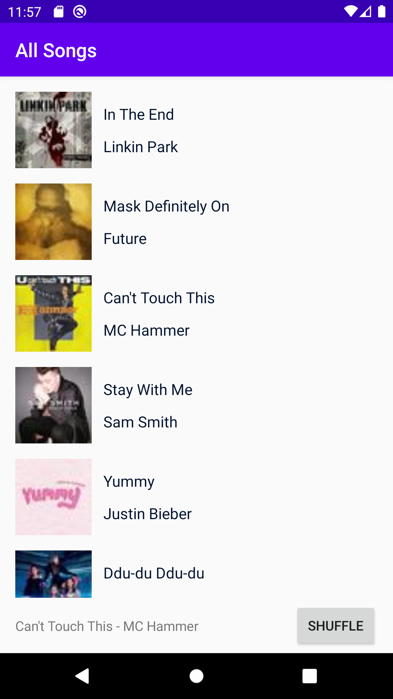
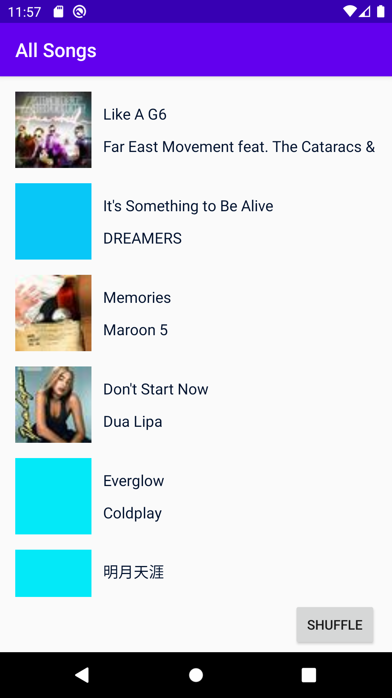
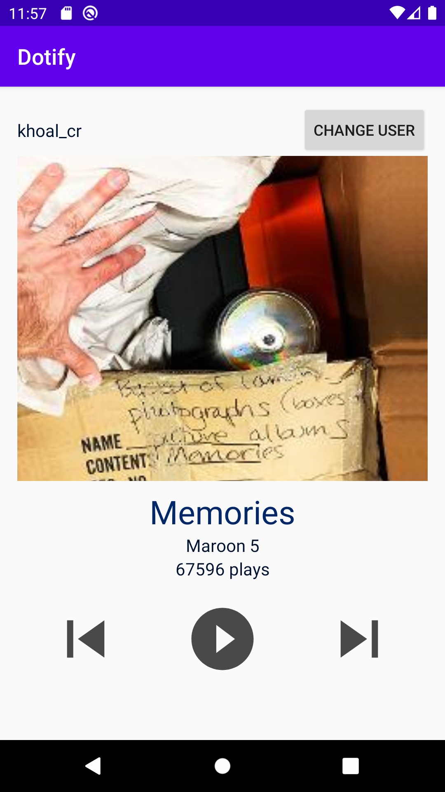

# Homework 2

Khoa Luong

This is the Dotify app. The user can change their name. The view count is randomized between 1 and 100000, if a user presses play 1 view will be added. An alert will pop up if they choose to go to the next or previous song. When starting the app, the user will see a list of songs that they can click on. On the action bar at the bottom, the user can click on the song title to go to a music player view, or click shuffle to change the order of the list.

Music list view:

Music player view:

